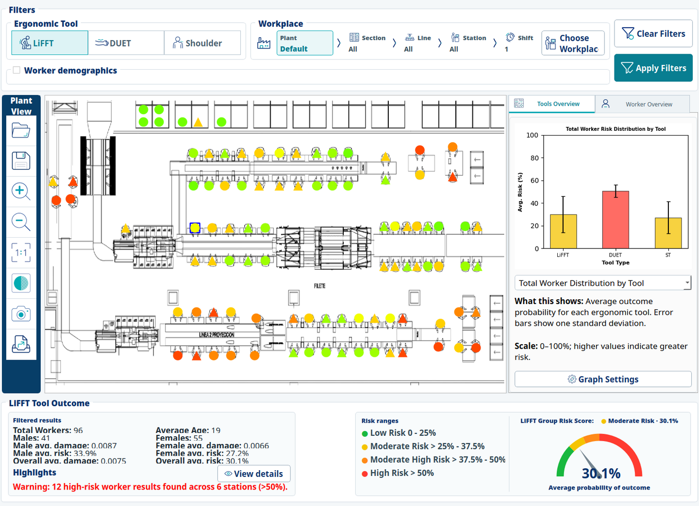
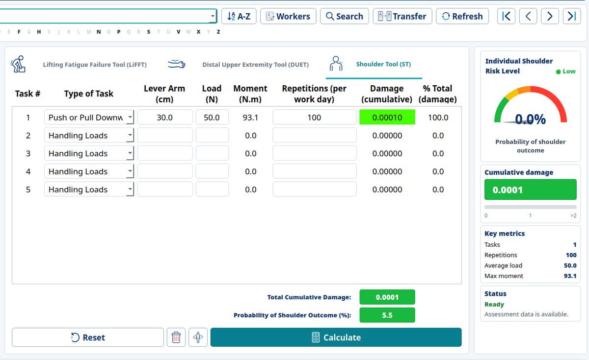
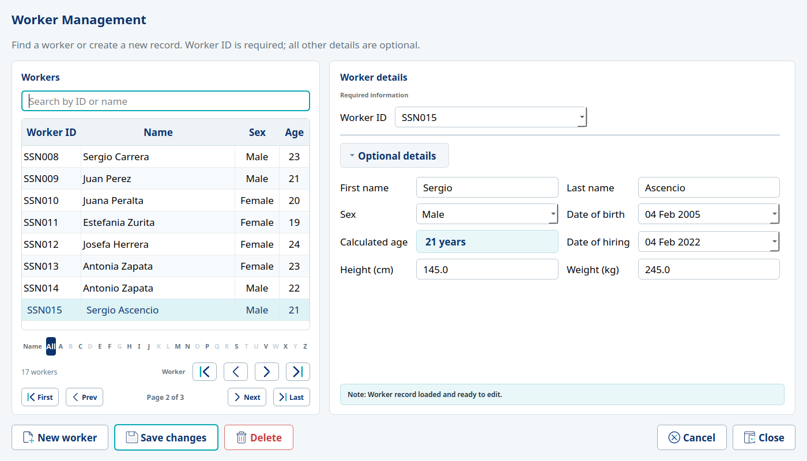
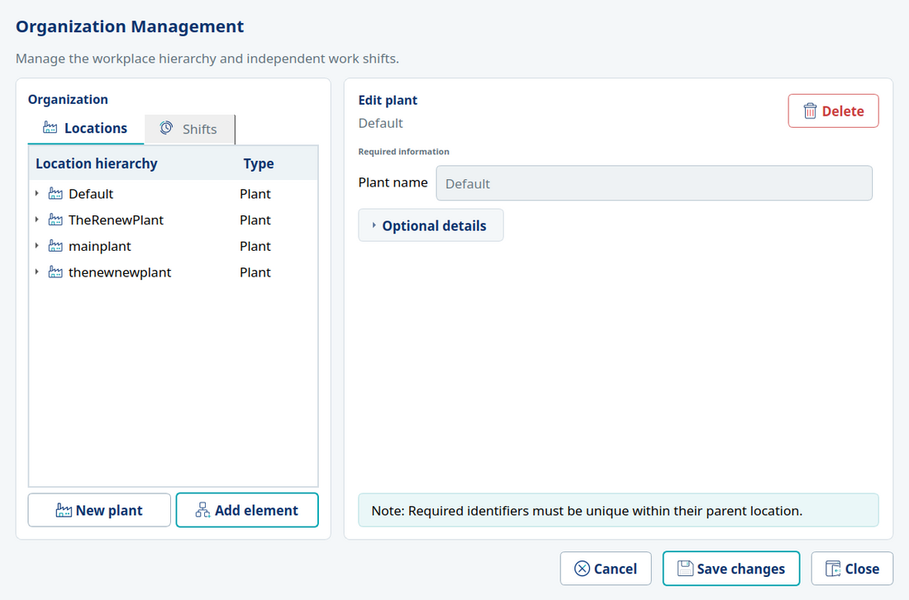
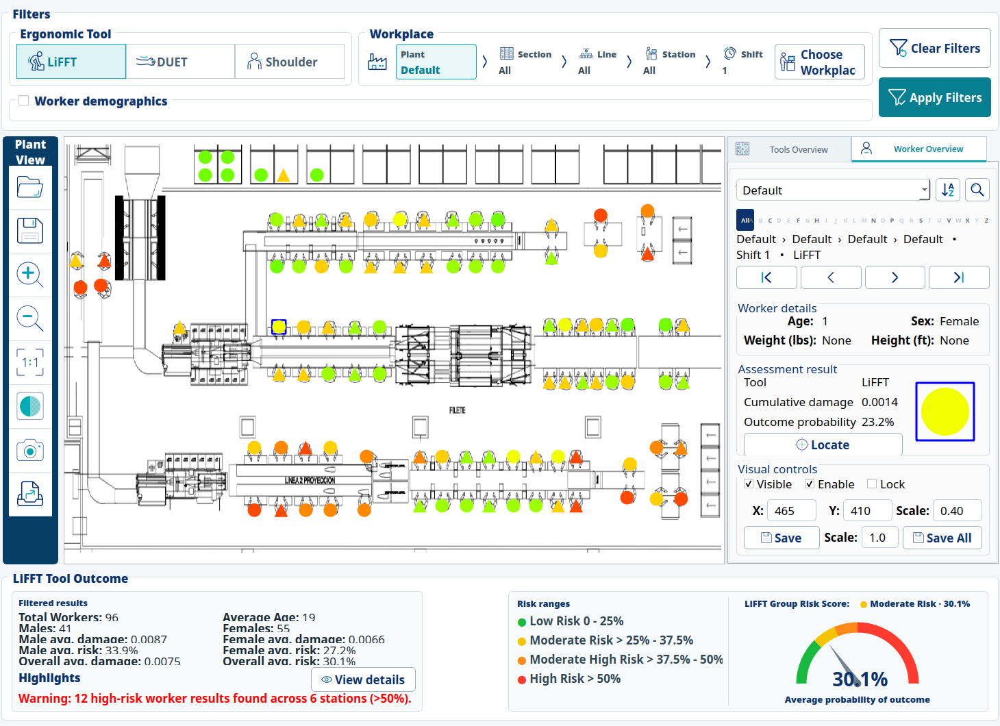
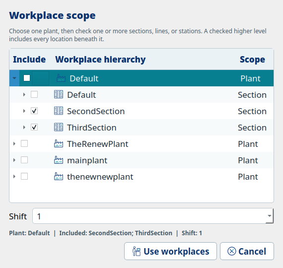

<div align="center">
  

# ErgoTools + PLOT

**Fatigue failure-based ergonomic assessment, from individual tasks to facility-wide risk maps**

[](https://www.python.org/)
[](https://www.riverbankcomputing.com/software/pyqt/)
[](#project-status)
[](#license)

[Overview](#overview) · [Capabilities](#key-capabilities) · [Scientific basis](#scientific-basis) · [Installation](#installation) · [Publications](#publications) · [Screenshots](#screenshots)
</div>



## Contents

- [Overview](#overview)
- [Key capabilities](#key-capabilities)
- [Scientific basis](#scientific-basis)
- [Workflow](#workflow)
- [Screenshots](#screenshots)
- [Installation](#installation)
- [Running ErgoTools](#running-ergotools)
- [Project files and data](#project-files-and-data)
- [Documentation](#documentation)
- [Publications](#publications)
- [Repository structure](#repository-structure)
- [Contributing](#contributing)
- [Project status](#project-status)
- [License](#license)

## Overview

ErgoTools is a desktop research application for evaluating cumulative work-related musculoskeletal disorder (MSD) risk. It brings three fatigue failure-based assessment methods into one workflow and connects individual results to workers, tasks, shifts, and a plant hierarchy.

The Plant-Layout Organizational Tool (PLOT) extends those assessments to a facility view. Worker results can be positioned over a plant layout, filtered by organizational scope and demographics, summarized by tool, and inspected at either group or individual level. The intent is to help ergonomists move from task measurements to spatially informed intervention priorities.

> [!IMPORTANT]
> ErgoTools is research software and a decision-support aid. Results require appropriate ergonomic expertise and should not be treated as medical diagnosis or as a substitute for professional judgment.

## Key capabilities

| Area | What ErgoTools provides |
| --- | --- |
| Individual assessment | Multi-task LiFFT, DUET, and Shoulder Tool calculations with cumulative damage and outcome probability |
| Anatomical context | Interactive 3D body-region visualization linked to the active assessment tool |
| Worker records | Searchable worker management, optional demographic data, paging, and alphabetical navigation |
| Organization model | Plant → section → line → station hierarchy plus independent shifts |
| Assessment context | Links a worker/tool result to its workplace and shift without changing the underlying hierarchy |
| PLOT risk mapping | Worker markers over a plant image, colored by the established risk scale |
| Filtering | Tool, plant hierarchy, shift, sex, age, weight, and height filters |
| Multi-scope analysis | Multiple sections, lines, or stations from one plant can be analyzed together |
| Summaries | Group risk gauge, filtered metrics, demographic comparisons, charts, and high-risk station details |
| Data reuse | Search, copy, or transfer assessments where work is shared between workers or contexts |

## Scientific basis

All three assessment methods estimate cumulative loading using fatigue failure principles, but they target different anatomical regions and use different task inputs.

| Tool | Region | Principal inputs | Foundational research |
| --- | --- | --- | --- |
| **LiFFT** — Lifting Fatigue Failure Tool | Low back | Load, horizontal lever arm, repetitions | Gallagher et al. (2017), [doi:10.1016/j.apergo.2017.04.016](https://doi.org/10.1016/j.apergo.2017.04.016) |
| **DUET** — Distal Upper Extremity Tool | Distal upper extremity | OMNI-RES exertion rating, repetitions | Gallagher et al. (2018), [doi:10.1177/0018720818789319](https://doi.org/10.1177/0018720818789319) |
| **Shoulder Tool** | Shoulder | Task type, load, lever arm, repetitions | Bani Hani et al. (2021), [doi:10.1080/00140139.2020.1811399](https://doi.org/10.1080/00140139.2020.1811399) |

The methods report cumulative damage and an estimated probability of an adverse outcome. ErgoTools preserves each tool's calculation model while providing a shared interface, project model, and organizational context.

## Workflow

```text
Create or open project
        ↓
Define organization and workers
        ↓
Enter task exposure data in LiFFT, DUET, or Shoulder Tool
        ↓
Calculate individual cumulative damage and outcome probability
        ↓
Associate the assessment with workplace and shift
        ↓
Use PLOT to filter, map, compare, and prioritize results
```

## Screenshots

### Individual assessment

The assessment workspace keeps task inputs, cumulative results, the animated risk gauge, key metrics, and data-quality status visible together.



### Worker and organization management

<table>
  <tr>
    <td width="50%"></td>
    <td width="50%"></td>
  </tr>
  <tr>
    <td align="center"><strong>Worker Management</strong><br>Search, navigation, required identity, and collapsible optional details.</td>
    <td align="center"><strong>Organization Management</strong><br>One hierarchy editor for plants, sections, lines, stations, and shifts.</td>
  </tr>
</table>

### PLOT worker inspection and workplace filtering



The workplace selector keeps one plant active while allowing multiple branches within that plant. Checking a higher level includes its descendants; individual sections, lines, and stations can be combined without losing their hierarchy paths.

<p align="center">
  
</p>

Screenshot sources are stored in [`docs/images`](docs/images/README.md). The individual assessment image is cropped around the assessment panels because automated documentation capture runs without production VTK rendering; it can be replaced by keeping the same filename.

## Installation

### Requirements

- Python **3.10**
- Git, if cloning the repository
- A desktop environment capable of running PyQt5 and VTK/OpenGL

The Python dependencies are declared in [`requirements.txt`](requirements.txt): PyQt5, VTK, PyQtWebEngine, PyCountry, PuLP, Pyomo, and solver integrations.

### Option A: Conda environment

Conda is recommended because VTK and Qt include compiled components.

```bash
git clone https://github.com/mhenriquezschott/ErgoTools.git
cd ErgoTools

conda create -n ergotools python=3.10
conda activate ergotools
python -m pip install --upgrade pip
python -m pip install -r requirements.txt
```

### Option B: Python virtual environment

```bash
git clone https://github.com/mhenriquezschott/ErgoTools.git
cd ErgoTools

python3.10 -m venv .venv
```

Activate the environment and install dependencies:

```bash
# Linux/macOS
source .venv/bin/activate

# Windows PowerShell
.venv\Scripts\Activate.ps1

python -m pip install --upgrade pip
python -m pip install -r requirements.txt
```

> [!NOTE]
> On Linux, the distribution's OpenGL and Qt/XCB runtime libraries may also be required. Package names vary by distribution and desktop environment.

## Running ErgoTools

Start without a project:

```bash
python src/main.py
```

Open an existing project directly:

```bash
python src/main.py /path/to/project.ergprj
```

The first launch with a project displays a confirmation dialog after the project has loaded.

## Project files and data

An `.ergprj` file describes the project and points to its associated data and image directories. Keep the descriptor and its companion project folder together when moving or sharing a project. The current development work preserves this format; any future incompatible format change should include an explicit migration path.

Do not commit operational or personally identifiable worker data to a public repository. Use synthetic or de-identified projects for examples, tests, screenshots, and issue reports.

## Documentation

- [ErgoTools user manual (PDF)](docs/ErgoToolManual.pdf) — current functional reference; some screenshots reflect the earlier interface.
- [PLOT responsive layout notes](docs/plot-responsive-layout.md) — layout constraints and responsive behavior.
- [PLOT redesign roadmap](docs/plot-redesign-roadmap.md) — staged UI modernization notes.
- [`docs/images`](docs/images/README.md) — replaceable screenshots used on this project page.

## Publications

### ErgoTools and PLOT

1. **Henriquez-Schott, M., Zabala, M., Sesek, R., Gallagher, S., & Nail-Ulloa, I. (2025).** PLOT: A Plant-Layout Organizational Tool Software Based on Fatigue Failure Theory for MSD Control and Mitigation. *Proceedings of the Human Factors and Ergonomics Society Annual Meeting, 69*(1), 625–632. [https://doi.org/10.1177/10711813251357881](https://doi.org/10.1177/10711813251357881)
2. **Henriquez-Schott, M., Zabala, M., Gallagher, S., Kotowski, S., Jorgensen, M., Davis, K., & Nail-Ulloa, I. (2025).** ErgoTools: Software Platform Integrating Fatigue Failure-Based Risk Assessment Tools for Ergonomics Evaluation in Salmon Processing. *Ergonomics in Design*. OnlineFirst. [https://doi.org/10.1177/10648046251408207](https://doi.org/10.1177/10648046251408207)
3. **Henríquez-Schott, M., Zabala, M., Mercado-Gallardo, V., Vásquez-Castillo, G., Gallagher, S., & Nail-Ulloa, I. (2025).** Integración de herramientas basadas en falla por fatiga para la evaluación ergonómica y productiva en la industria salmonera chilena: desarrollo de software y casos de estudio. *Ergonomía, Investigación y Desarrollo, 7*(2), 11–30. [https://doi.org/10.29393/EID7-11IHMI60011](https://doi.org/10.29393/EID7-11IHMI60011)

### Conference presentations

| Year and dates | Presentation | Event and location | Role | Program |
| --- | --- | --- | --- | --- |
| **2025** · October 12–17 | **PLOT: A Plant-Layout Organizational Tool Based on Fatigue Failure Theory for MSD Control and Mitigation** | HFES 69th International Annual Meeting (ASPIRE 2025), Chicago, Illinois, USA. Presented October 15 in the *Effort and Fatigue* session. | Author | [Official presentation record](https://hfesam2025.conference-program.com/presentation/?id=LECT420&sess=sess241) |
| **2025** | ErgoTools/PLOT research dissemination at the Applied Human Factors and Ergonomics International Conference | Applied Human Factors and Ergonomics (AHFE 2025) | — | [Official AHFE 2025 program](https://www.ahfe.org/files/AHFE2025_FinalProgram.pdf) |
| **2024** · September 9–13 | **Fatigue Failure Risk Assessment Tool: A Software for Integrated Approach to Ergonomic Analysis** | ASPIRE 2024 International Annual Meeting, Phoenix, Arizona, USA | Co-author | [Event information](https://iea.cc/event/aspire-the-hfes-international-annual-meeting/) |

The AHFE 2025 row records the conference association supplied by the project team. Its presentation title, exact date, location, authorship role, and direct program entry remain to be added when those details are available.

### Citing the software

Until a versioned software DOI and preferred software citation are published, cite the publication most closely related to your use:

- Cite the **PLOT paper** for plant-layout risk mapping and organizational analysis.
- Cite the **ErgoTools platform paper** or the Spanish case-study paper for the integrated assessment application.
- Cite the corresponding foundational paper when reporting LiFFT, DUET, or Shoulder Tool results.

## Repository structure

| Path | Purpose |
| --- | --- |
| `src/` | PyQt5 application, assessment tools, PLOT, and VTK interaction code |
| `assets/ui-icons/` | Processed, runtime-ready ErgoTools icon set |
| `models/` | Anatomical 3D model assets used by the main assessment view |
| `data/` | Base application data |
| `docs/` | Technical notes, manual, and README screenshots |
| `tests/` | UI smoke and responsive-layout checks |
| `requirements.txt` | Python dependency list |

## Contributing

This codebase is undergoing staged UI and architecture improvements. Contributions should be narrowly scoped and preserve existing project compatibility unless a migration is explicitly designed and documented.

For UI changes:

1. Reuse the palette, typography, spacing, controls, and processed assets in `assets/ui-icons/`.
2. Test populated, empty, selected, collapsed, and expanded states.
3. Check the complete window at its target size so VTK content, result cards, labels, and bottom controls are not clipped.
4. Include clear reproduction steps and screenshots with bug reports.

## Project status

ErgoTools/PLOT is active research software. The current branch focuses on a coherent PyQt5 interface, clearer information flow, responsive PLOT layouts, and preserving the existing `.ergprj` project format while larger architectural work is planned.

## License

The repository does not currently contain a `LICENSE` file. Although the research publications describe ErgoTools as open-source software, an explicit license must be added before downstream users have clear permission to copy, modify, or redistribute the code. Project maintainers should select and add the intended license rather than relying on the repository's public visibility.
