<div align="center">
  

# ErgoTools + PLOT

**Fatigue failure-based ergonomic assessment, from individual tasks to facility-wide risk maps**

[](https://www.python.org/)
[](https://www.riverbankcomputing.com/software/pyqt/)
[](#project-status)
[](LICENSE.txt)

[Overview](#overview) · [ErgoTools](#ergotools-individual-assessment) · [PLOT](#plot-organizational-analysis) · [Scientific basis](#scientific-basis) · [Installation](#installation) · [Publications](#publications)
</div>


## Contents

- [Overview](#overview)
- [Key capabilities](#key-capabilities)
- [Scientific basis](#scientific-basis)
- [Workflow](#workflow)
- [ErgoTools individual assessment](#ergotools-individual-assessment)
- [PLOT organizational analysis](#plot-organizational-analysis)
- [Installation](#installation)
- [Running ErgoTools](#running-ergotools)
- [Project files and data](#project-files-and-data)
- [Documentation](#documentation)
- [Publications](#publications)
- [Repository structure](#repository-structure)
- [Contributing](#contributing)
- [Project status](#project-status)
- [License](#license)

## Overview

ErgoTools is a desktop research application for evaluating cumulative work-related musculoskeletal disorder (MSD) risk. It brings three fatigue failure-based assessment methods into one workflow and connects individual results to workers, tasks, shifts, and a plant hierarchy.

The Plant-Layout Organizational Tool (PLOT) extends individual assessments to the organizational and facility levels. It places worker results on a plant layout and supports analysis by ergonomic tool, section, line, station, shift, and worker demographics. PLOT combines spatial risk mapping with group summaries and individual-result inspection to support identification of elevated exposures and prioritization of ergonomic interventions.

> [!IMPORTANT]
> ErgoTools is research software and a decision-support aid. Results require appropriate ergonomic expertise and should not be treated as medical diagnosis or as a substitute for professional judgment.

## Key capabilities

| Area | What ErgoTools provides |
| --- | --- |
| Individual assessment | Multi-task LiFFT, DUET, and Shoulder Tool calculations with cumulative damage and outcome probability |
| Anatomical context | Interactive 3D body-region visualization linked to the active assessment tool |
| Worker records | Searchable worker management, optional demographic data, paging, and alphabetical navigation |
| Organization model | Plant → section → line → station hierarchy plus independent shifts |
| Assessment context | Links a worker/tool result to its workplace and shift without changing the underlying hierarchy |
| PLOT risk mapping | Worker markers over a plant image, colored by the established risk scale |
| Filtering | Tool, plant hierarchy, shift, sex, age, weight, and height filters |
| Multi-scope analysis | Multiple sections, lines, or stations from one plant can be analyzed together |
| Summaries | Mean outcome probability, cumulative-damage summaries, demographic comparisons, charts, and high-risk station details |
| Data reuse | Search, copy, or transfer assessments where work is shared between workers or contexts |

## Scientific basis

All three assessment methods estimate cumulative loading using fatigue failure principles, but they target different anatomical regions and use different task inputs.

| Tool | Region | Principal inputs | Foundational research |
| --- | --- | --- | --- |
| **LiFFT** — Lifting Fatigue Failure Tool | Low back | Load, horizontal lever arm, repetitions | Gallagher et al. (2017), [doi:10.1016/j.apergo.2017.04.016](https://doi.org/10.1016/j.apergo.2017.04.016) |
| **DUET** — Distal Upper Extremity Tool | Distal upper extremity | OMNI-RES exertion rating, repetitions | Gallagher et al. (2018), [doi:10.1177/0018720818789319](https://doi.org/10.1177/0018720818789319) |
| **Shoulder Tool** | Shoulder | Task type, load, lever arm, repetitions | Bani Hani et al. (2021), [doi:10.1080/00140139.2020.1811399](https://doi.org/10.1080/00140139.2020.1811399) |

The methods report cumulative damage and an estimated probability of an adverse outcome. ErgoTools preserves each tool's calculation model while providing a shared interface, project model, and organizational context.

## Workflow

```text
Create or open project
        ↓
Define organization and workers
        ↓
Enter task exposure data in LiFFT, DUET, or Shoulder Tool
        ↓
Calculate individual cumulative damage and outcome probability
        ↓
Associate the assessment with workplace and shift
        ↓
Use PLOT to filter, map, compare, and prioritize results
```

## ErgoTools individual assessment

The main ErgoTools workspace combines project and worker selection, anatomical context, task-level exposure data, calculation controls, and individual results. A common structure is retained across LiFFT, DUET, and the Shoulder Tool so that analysts can change methods without changing the overall workflow.

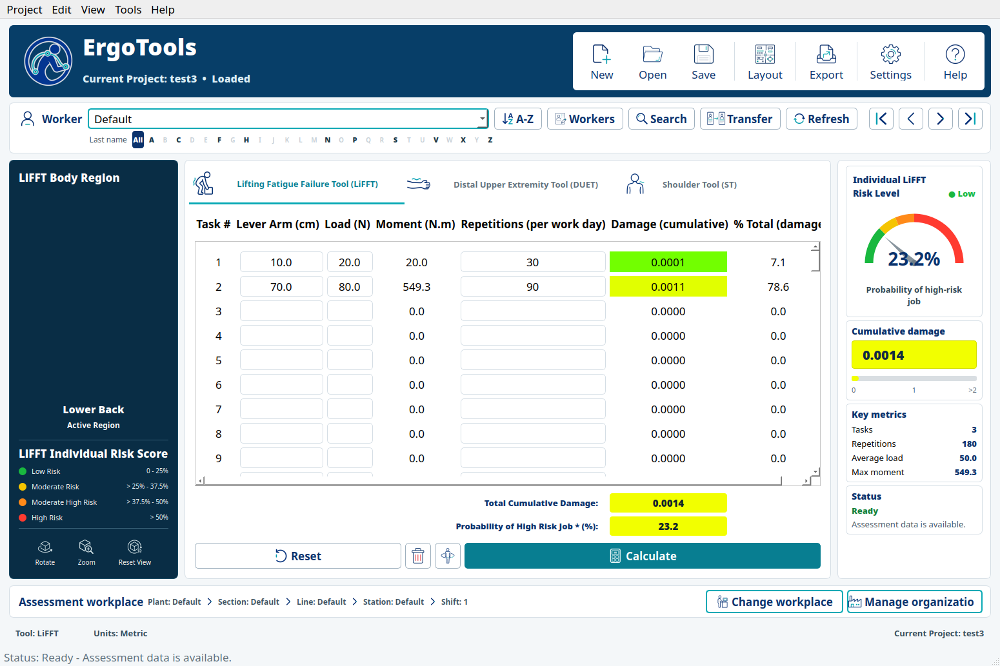

The header identifies the active project and provides project-level actions. The worker bar supports direct selection, alphabetical filtering, record management, search, transfer of existing assessment data, and sequential navigation. The workplace strip records the plant, section, line, station, and shift associated with the assessment; this analytical assignment is distinct from the worker's identity record.

### Anatomical and analytical context

<table>
  <tr>
    <td width="24%">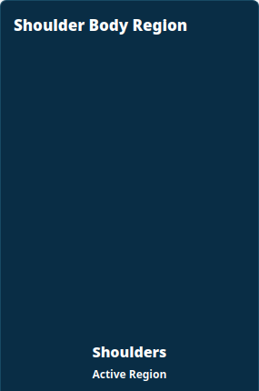</td>
    <td width="56%">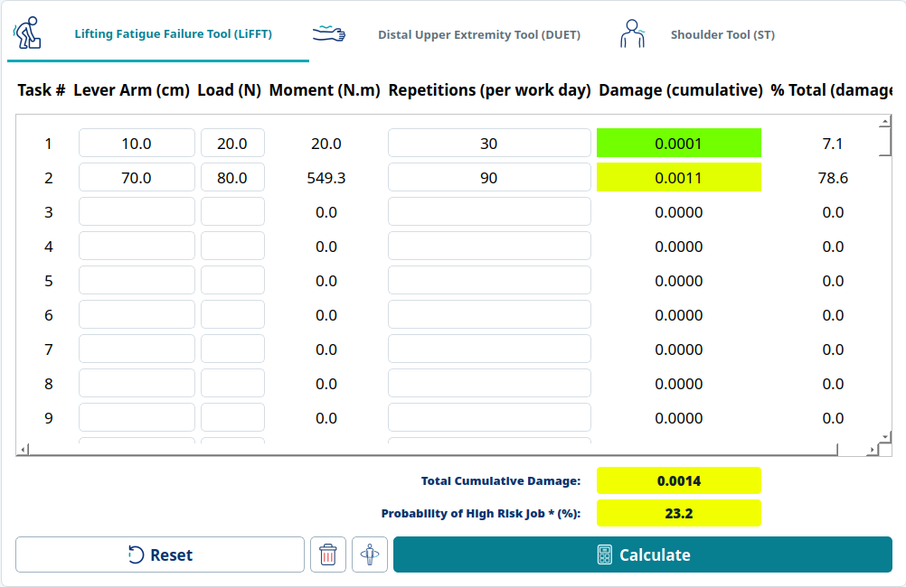</td>
    <td width="20%">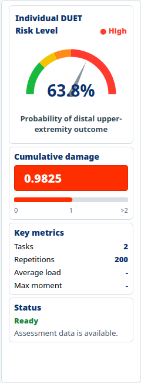</td>
  </tr>
  <tr>
    <td valign="top"><strong>Body region</strong><br>The anatomical view identifies the region evaluated by the active method. Rotation, zoom, and reset controls support inspection, while the adjacent legend states the individual risk categories.</td>
    <td valign="top"><strong>Task assessment</strong><br>Each row represents an exposure component. The table reports its cumulative-damage contribution and share of total damage; the calculation area reports the aggregate damage and outcome probability.</td>
    <td valign="top"><strong>Individual results</strong><br>The gauge reports estimated outcome probability and its risk category. Cumulative damage, task count, repetitions, key exposure metrics, and data-completeness status remain visible beside the assessment.</td>
  </tr>
</table>

Cumulative damage and outcome probability are related outputs but are not interchangeable. Cumulative damage is the fatigue-failure exposure measure accumulated across entered tasks. The probability gauge expresses the model-derived likelihood of the tool-specific adverse outcome and maps it to the established risk categories. A gray result state indicates that an assessment is unavailable or incomplete rather than a measured low-risk result.

### Assessment methods

#### LiFFT

LiFFT evaluates low-back loading from load, horizontal lever arm, and repetitions. ErgoTools calculates task moment, cumulative damage, percentage contribution, and probability of a high-risk job.


#### DUET

DUET evaluates distal upper-extremity loading from OMNI-RES exertion ratings and repetitions. The task table shows which exertions dominate cumulative damage and the resulting distal upper-extremity outcome probability.

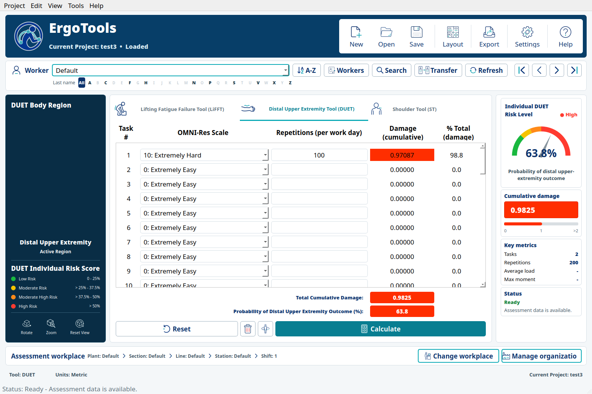

#### Shoulder Tool

The Shoulder Tool combines task type, lever arm, load, and repetitions to estimate shoulder cumulative damage and outcome probability.

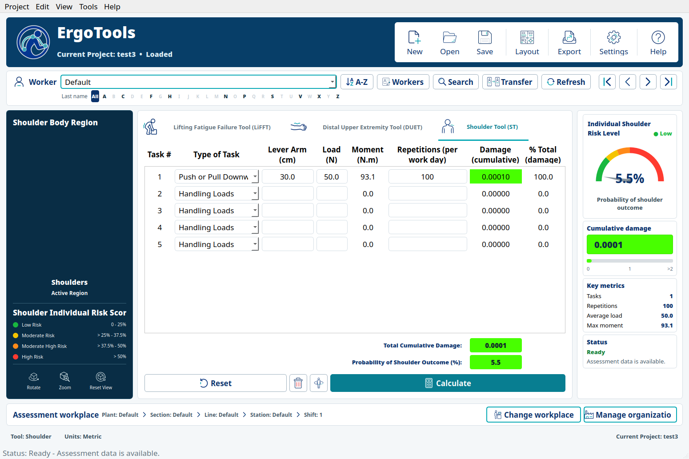

### Worker and organization management

<table>
  <tr>
    <td width="50%"></td>
    <td width="50%"></td>
  </tr>
  <tr>
    <td align="center"><strong>Worker Management</strong><br>Search, navigation, required identity, and collapsible optional details.</td>
    <td align="center"><strong>Organization Management</strong><br>One hierarchy editor for plants, sections, lines, stations, and shifts.</td>
  </tr>
</table>

Worker records and workplace entities are maintained separately from calculation inputs. Worker identity requires only a unique identifier; demographic and employment details remain optional. The organization editor manages the plant → section → line → station hierarchy and independent shifts used to contextualize assessments and filter PLOT results.

## PLOT organizational analysis

PLOT displays one plant layout at a time and superimposes enabled assessment results at their assigned stations. Circles and triangles distinguish worker sex, marker color represents the applicable risk category, and a blue frame identifies the selected result. The plant-view rail provides layout loading and saving, zoom, fit, opacity, visibility, capture, and export operations.


### Defining the analytical population

The filter area selects the ergonomic tool, one plant, a shift, and one or more scopes inside that plant. Optional demographic ranges can further restrict the displayed population by sex, age, weight, or height. Applying a filter updates the markers, overview graphs, filtered-result statistics, highlights, and group outcome together.

The workplace selector preserves the organizational hierarchy. Selecting a section, line, or station restricts the population to that scope; selecting a higher-level node includes its descendants. Multiple branches within the same plant can be combined, while the plant selection determines the background layout displayed in the central view.

<p align="center">
  
</p>

### Tools Overview

Tools Overview provides three complementary population summaries. Error bars show one standard deviation, and Graph Settings supports visual configuration and figure export.

<table>
  <tr>
    <td width="33.33%">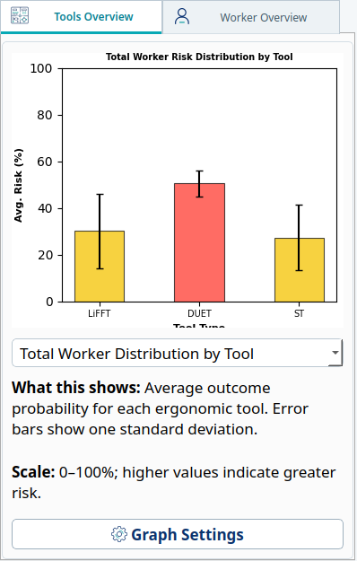</td>
    <td width="33.33%">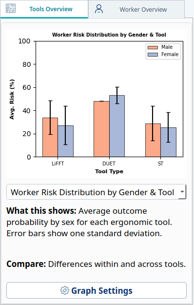</td>
    <td width="33.33%">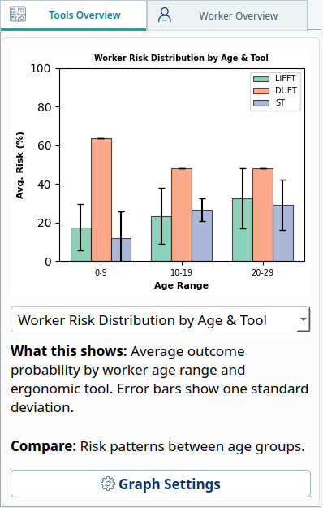</td>
  </tr>
  <tr>
    <td valign="top"><strong>Tool comparison</strong><br>Compares mean outcome probability across LiFFT, DUET, and Shoulder Tool results in the active scope.</td>
    <td valign="top"><strong>Sex-stratified comparison</strong><br>Compares mean outcome probability for male and female workers within and across tools.</td>
    <td valign="top"><strong>Age-stratified comparison</strong><br>Compares tool-specific mean outcome probability across the age ranges represented in the filtered data.</td>
  </tr>
</table>

### Worker Overview

Worker Overview connects an individual result to its position on the plant map. The selector and alphabet strip navigate the workers available under the applied filters; the assignment path identifies workplace, shift, and tool. The panel reports demographics, cumulative damage, and outcome probability, and uses the same circle or triangle, risk color, and blue selection frame shown on the plant layout.


<table>
  <tr>
    <td width="42%">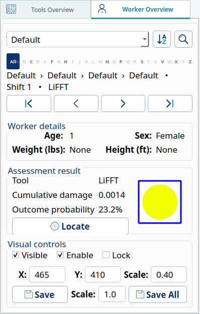</td>
    <td width="58%">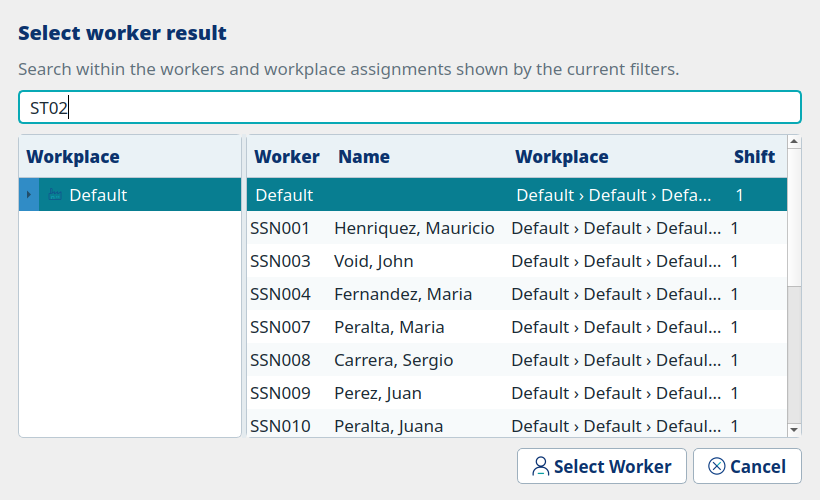</td>
  </tr>
  <tr>
    <td valign="top"><strong>Inspect and locate</strong><br>Navigation changes the selected marker. Locate pulses its blue frame to find it within a dense layout. Visibility, enablement, locking, scale, and saved placement control how the result participates in the plant view.</td>
    <td valign="top"><strong>Select within scope</strong><br>The worker-result selector searches the currently filtered population and uses the workplace tree to narrow records with similar names or multiple assignments.</td>
  </tr>
</table>

### Tool outcomes and group risk

The outcome panel is specific to the applied ergonomic-tool filter. Its group risk score is the mean outcome probability across enabled worker results that satisfy the active filters. The gauge shows that mean on the common risk scale; it does not represent cumulative damage or replace the individual assessment.

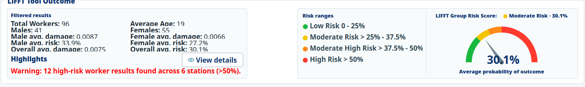

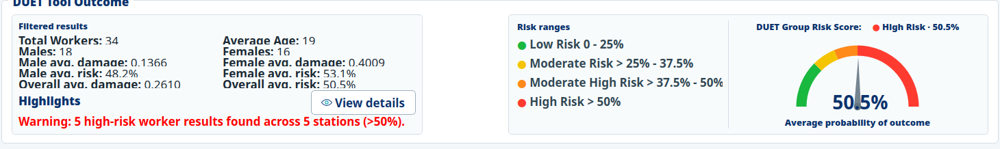

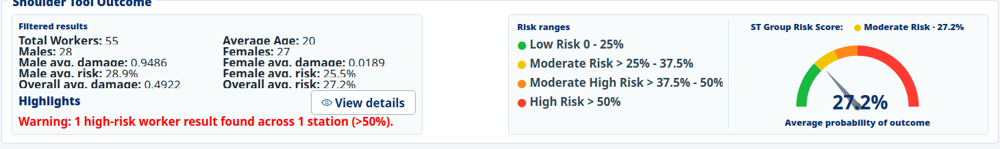

The filtered summary reports worker counts, age, sex-specific mean cumulative damage and outcome probability, and overall means. High-risk highlights identify stations containing results above the high-risk threshold. View Details opens the contributing stations with result counts, average outcome probability, and maximum outcome probability for follow-up.

<p align="center">
  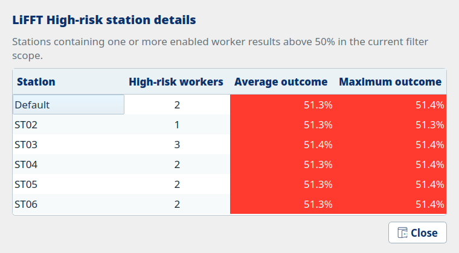
</p>

Together, the map, population summaries, individual inspection, and station highlights support movement from facility-level screening to specific workers and locations requiring closer ergonomic review.

## Installation

### Requirements

- Python **3.10**
- Git, if cloning the repository
- A desktop environment capable of running PyQt5 and VTK/OpenGL

The Python dependencies are declared in [`requirements.txt`](requirements.txt): PyQt5, VTK, PyQtWebEngine, PyCountry, PuLP, Pyomo, and solver integrations.

### Option A: Conda environment

Conda is recommended because VTK and Qt include compiled components.

```bash
git clone https://github.com/mhenriquezschott/ErgoTools.git
cd ErgoTools

conda create -n ergotools python=3.10
conda activate ergotools
python -m pip install --upgrade pip
python -m pip install -r requirements.txt
```

### Option B: Python virtual environment

```bash
git clone https://github.com/mhenriquezschott/ErgoTools.git
cd ErgoTools

python3.10 -m venv .venv
```

Activate the environment and install dependencies:

```bash
# Linux/macOS
source .venv/bin/activate

# Windows PowerShell
.venv\Scripts\Activate.ps1

python -m pip install --upgrade pip
python -m pip install -r requirements.txt
```

> [!NOTE]
> On Linux, the distribution's OpenGL and Qt/XCB runtime libraries may also be required. Package names vary by distribution and desktop environment.

## Running ErgoTools

Start without a project:

```bash
python src/main.py
```

Open an existing project directly:

```bash
python src/main.py /path/to/project.ergprj
```

The first launch with a project displays a confirmation dialog after the project has loaded.

## Project files and data

An `.ergprj` file describes the project and points to its associated data and image directories. Keep the descriptor and its companion project folder together when moving or sharing a project. The current development work preserves this format; any future incompatible format change should include an explicit migration path.

Do not commit operational or personally identifiable worker data to a public repository. Use synthetic or de-identified projects for examples, tests, screenshots, and issue reports.

## Documentation

- [ErgoTools user manual (PDF)](docs/ErgoToolManual.pdf)

## Publications

### ErgoTools and PLOT

1. **Henriquez-Schott, M., Zabala, M., Sesek, R., Gallagher, S., & Nail-Ulloa, I. (2025).** PLOT: A Plant-Layout Organizational Tool Software Based on Fatigue Failure Theory for MSD Control and Mitigation. *Proceedings of the Human Factors and Ergonomics Society Annual Meeting, 69*(1), 625–632. [https://doi.org/10.1177/10711813251357881](https://doi.org/10.1177/10711813251357881)
2. **Henriquez-Schott, M., Zabala, M., Gallagher, S., Kotowski, S., Jorgensen, M., Davis, K., & Nail-Ulloa, I. (2025).** ErgoTools: Software Platform Integrating Fatigue Failure-Based Risk Assessment Tools for Ergonomics Evaluation in Salmon Processing. *Ergonomics in Design*. OnlineFirst. [https://doi.org/10.1177/10648046251408207](https://doi.org/10.1177/10648046251408207)
3. **Henríquez-Schott, M., Zabala, M., Mercado-Gallardo, V., Vásquez-Castillo, G., Gallagher, S., & Nail-Ulloa, I. (2025).** Integración de herramientas basadas en falla por fatiga para la evaluación ergonómica y productiva en la industria salmonera chilena: desarrollo de software y casos de estudio. *Ergonomía, Investigación y Desarrollo, 7*(2), 11–30. [https://doi.org/10.29393/EID7-11IHMI60011](https://doi.org/10.29393/EID7-11IHMI60011)

### Conference presentations

| Year and dates | Presentation | Event and location | Role | Program |
| --- | --- | --- | --- | --- |
| **2025** · October 12–17 | **PLOT: A Plant-Layout Organizational Tool Based on Fatigue Failure Theory for MSD Control and Mitigation** | HFES 69th International Annual Meeting (ASPIRE 2025), Chicago, Illinois, USA. Presented October 15 in the *Effort and Fatigue* session. | Author | [Official presentation record](https://hfesam2025.conference-program.com/presentation/?id=LECT420&sess=sess241) |
| **2025** | ErgoTools/PLOT research dissemination at the Applied Human Factors and Ergonomics International Conference | Applied Human Factors and Ergonomics (AHFE 2025) | — | [Official AHFE 2025 program](https://www.ahfe.org/files/AHFE2025_FinalProgram.pdf) |
| **2024** · September 9–13 | **Fatigue Failure Risk Assessment Tool: A Software for Integrated Approach to Ergonomic Analysis** | ASPIRE 2024 International Annual Meeting, Phoenix, Arizona, USA | Co-author | [Event information](https://iea.cc/event/aspire-the-hfes-international-annual-meeting/) |

The AHFE 2025 row records the conference association supplied by the project team. Its presentation title, exact date, location, authorship role, and direct program entry remain to be added when those details are available.

### Citing the software

Until a versioned software DOI and preferred software citation are published, cite the publication most closely related to your use:

- Cite the **PLOT paper** for plant-layout risk mapping and organizational analysis.
- Cite the **ErgoTools platform paper** or the Spanish case-study paper for the integrated assessment application.
- Cite the corresponding foundational paper when reporting LiFFT, DUET, or Shoulder Tool results.

## Repository structure

| Path | Purpose |
| --- | --- |
| `src/` | PyQt5 application, assessment tools, PLOT, and VTK interaction code |
| `assets/ui-icons/` | Processed, runtime-ready ErgoTools icon set |
| `models/` | Anatomical 3D model assets used by the main assessment view |
| `data/` | Base application data |
| `docs/` | Technical notes, manual, and README screenshots |
| `tests/` | UI smoke and responsive-layout checks |
| `requirements.txt` | Python dependency list |

## Contributing

This codebase is undergoing staged UI and architecture improvements. Contributions should be narrowly scoped and preserve existing project compatibility unless a migration is explicitly designed and documented.

For UI changes:

1. Reuse the palette, typography, spacing, controls, and processed assets in `assets/ui-icons/`.
2. Test populated, empty, selected, collapsed, and expanded states.
3. Check the complete window at its target size so VTK content, result cards, labels, and bottom controls are not clipped.
4. Include clear reproduction steps and screenshots with bug reports.

## Project status

ErgoTools/PLOT is active research software for integrating fatigue failure-based assessment methods with worker- and facility-level ergonomic analysis. Continued development includes validation with practitioner feedback, refinement of analytical and reporting functions, and improvement of software maintainability while preserving access to existing `.ergprj` projects.

## License

ErgoTools is distributed under the [Apache License 2.0](LICENSE.txt). The license permits use, reproduction, modification, and distribution subject to its terms and conditions, including preservation of required notices and documentation of modified files.
