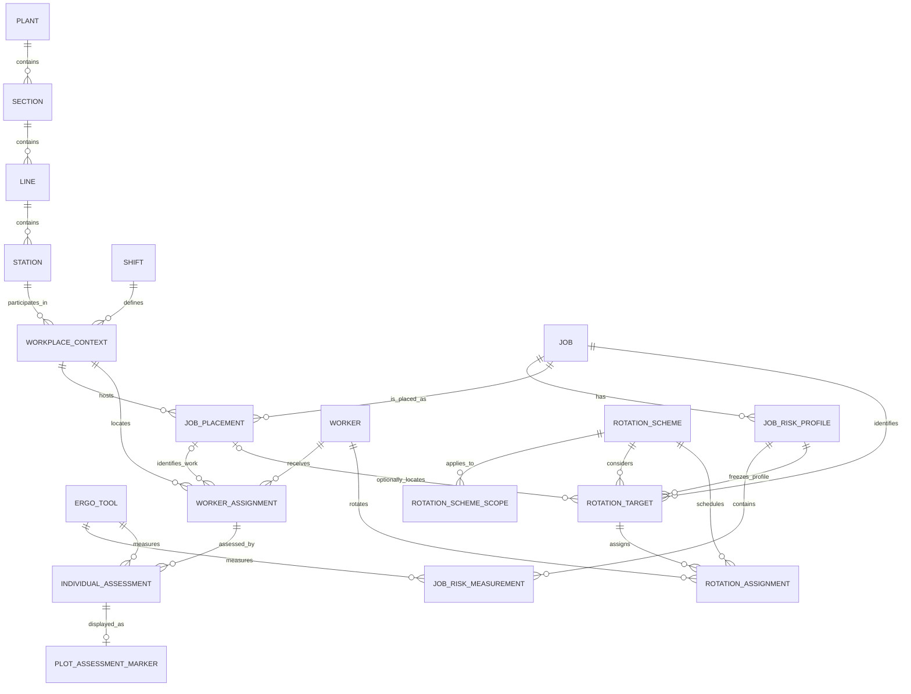

# Integrated Work and Risk Data Model Plan

This document is the implementation checklist for unifying ErgoTools, PLOT, and
JROT around one coherent database. The work is not complete until every required
phase and acceptance gate below is checked. Temporary compatibility code may be
used during migration, but dual schemas and dual-write paths are not an accepted
final state.

## Status

- [x] Agree that Station and Job are separate domain entities.
- [x] Agree that Job may exist without an organizational placement.
- [x] Agree that worker risk belongs to a worker assignment and therefore has
  worker, job when known, station, shift, tool, and assessment context.
- [x] Create and push the pre-change backup branch
  `backup/pre-integrated-risk-schema-20260912` at `4a8b68c`.
- [x] Inventory the current integrated test database and establish baseline counts.
- [ ] Implement and verify the target schema and all application changes.
- [ ] Generate the comparative-risk test project and verify the final UI.
- [ ] Remove temporary compatibility paths and document the completed model.

## Non-negotiable Decisions

1. **Station means physical place.** It remains part of the Plant, Section, Line,
   Station hierarchy used by PLOT.
2. **Job means work performed.** It owns job-level ergonomic risk profiles used
   by JROT and may exist without a plant or station.
3. **Job and Station are not aliases and are not one-to-one.** Their relationship
   is many-to-many through Job Placement.
4. **No fake organization records.** Creating a standalone JROT job must not
   create placeholder plants, sections, lines, or stations.
5. **Worker risk is contextual.** An individual result is an assessment of a
   worker assignment, not a timeless property of a Worker, Job, or Station.
6. **Job risk and individual risk remain distinct.** They may be compared but
   are never overwritten, averaged together, or stored in the same subject row.
7. **Risk colors are presentation data.** Risk bands and foreground/background
   colors are derived from numeric results by the shared risk-range code and are
   not authoritative database values.
8. **Risk history is preserved.** Job profiles and individual assessments are
   versioned; edits create or replace an explicit draft/current version according
   to the workflow rather than silently changing historical optimization inputs.
9. **New projects are born at the current schema version.** They must not create
   the legacy schema and then migrate it. Migration exists only for older projects.
10. **Foreign keys are enabled on every connection.** No repository or utility
    may depend on SQLite's default disabled foreign-key behavior.

## Domain Model

## Target Schema

Names below are the required target concepts. Final DDL must be placed in
versioned migration modules and tested independently of the UI.

### SchemaMigration

Tracks every applied migration.

- `version INTEGER PRIMARY KEY`
- `name TEXT NOT NULL`
- `checksum TEXT NOT NULL`
- `applied_at TEXT NOT NULL`
- `application_version TEXT`

`PRAGMA user_version` must match the highest successful migration. A checksum
mismatch is an error, not something the application silently ignores.

### WorkplaceContext

Provides a stable surrogate key for the exact Station plus Shift context that is
currently repeated in long composite keys.

- `id INTEGER PRIMARY KEY`
- `plant_name TEXT NOT NULL`
- `section_name TEXT NOT NULL`
- `line_name TEXT NOT NULL`
- `station_id TEXT NOT NULL`
- `shift_id TEXT NOT NULL`
- Unique constraint across all five organization fields.
- Composite foreign key to Station and foreign key to Shift.

### Job

Retains the current human-facing job identity independently of organization.

- `id TEXT PRIMARY KEY`
- `name TEXT NOT NULL`
- `description TEXT`
- `active INTEGER NOT NULL DEFAULT 1 CHECK (active IN (0, 1))`
- `created_at TEXT NOT NULL`
- `updated_at TEXT NOT NULL`

### JobRiskProfile

Represents one documented, versioned estimate of the risk of a Job. A profile
may contain LiFFT, DUET, and Shoulder measurements but does not require all three.

- `id INTEGER PRIMARY KEY`
- `job_id TEXT NOT NULL`
- `name TEXT NOT NULL`
- `version INTEGER NOT NULL CHECK (version > 0)`
- `status TEXT NOT NULL CHECK (status IN ('draft', 'approved', 'retired'))`
- `is_current INTEGER NOT NULL DEFAULT 0 CHECK (is_current IN (0, 1))`
- `source_type TEXT NOT NULL CHECK (source_type IN
  ('expert', 'external', 'study', 'aggregate', 'imported'))`
- `source_reference TEXT`
- `methodology TEXT`
- `sample_size INTEGER CHECK (sample_size IS NULL OR sample_size >= 0)`
- `assessed_on TEXT`
- `valid_from TEXT`
- `valid_to TEXT`
- `notes TEXT`
- `created_at TEXT NOT NULL`
- `updated_at TEXT NOT NULL`
- Unique constraint on `(job_id, version)`.
- Partial unique index allowing no more than one current approved profile per Job.
- Date-order checks for validity ranges.

### JobRiskMeasurement

Stores the tool results belonging to a Job Risk Profile.

- `profile_id INTEGER NOT NULL`
- `tool_id TEXT NOT NULL`
- `total_cumulative_damage REAL CHECK (total_cumulative_damage IS NULL OR total_cumulative_damage >= 0)`
- `probability_outcome REAL CHECK (probability_outcome IS NULL OR probability_outcome BETWEEN 0 AND 100)`
- `unit TEXT`
- `notes TEXT`
- Primary key `(profile_id, tool_id)`.
- Foreign keys to JobRiskProfile and ErgoTool.
- No stored color column.

### JobPlacement

Maps a Job to an exact workplace context. Multiple placements are allowed for a
Job, and a workplace may host different Jobs.

- `id INTEGER PRIMARY KEY`
- `job_id TEXT NOT NULL`
- `workplace_context_id INTEGER NOT NULL`
- `active INTEGER NOT NULL DEFAULT 1 CHECK (active IN (0, 1))`
- `valid_from TEXT`
- `valid_to TEXT`
- `notes TEXT`
- Foreign keys to Job and WorkplaceContext.
- Indexes on Job, workplace context, and active validity dates.
- Duplicate and overlapping active placements are rejected.

If a Job applies to all shifts at a station, the UI creates placements for the
selected known shifts in one operation. The database still stores exact contexts.

### WorkerAssignment

Identifies where a Worker is assigned and, when known, which placed Job is being
performed.

- `id INTEGER PRIMARY KEY`
- `worker_id TEXT NOT NULL`
- `workplace_context_id INTEGER NOT NULL`
- `job_placement_id INTEGER`
- `started_at TEXT`
- `ended_at TEXT`
- `active INTEGER NOT NULL DEFAULT 1 CHECK (active IN (0, 1))`
- `notes TEXT`
- Foreign keys to Worker, WorkplaceContext, and nullable JobPlacement.
- A database trigger rejects a Job Placement whose workplace context differs
  from the Worker Assignment context.
- A null `job_placement_id` explicitly means that the legacy or current worker
  location is known but the Job has not yet been classified.

### IndividualAssessment

Stores the worker-specific result header and summary values.

- `id INTEGER PRIMARY KEY`
- `worker_assignment_id INTEGER NOT NULL`
- `tool_id TEXT NOT NULL`
- `version INTEGER NOT NULL CHECK (version > 0)`
- `status TEXT NOT NULL CHECK (status IN ('draft', 'complete', 'superseded'))`
- `is_current INTEGER NOT NULL DEFAULT 0 CHECK (is_current IN (0, 1))`
- `assessed_at TEXT`
- `unit TEXT`
- `total_cumulative_damage REAL CHECK (total_cumulative_damage IS NULL OR total_cumulative_damage >= 0)`
- `probability_outcome REAL CHECK (probability_outcome IS NULL OR probability_outcome BETWEEN 0 AND 100)`
- `notes TEXT`
- Foreign keys to WorkerAssignment and ErgoTool.
- Unique `(worker_assignment_id, tool_id, version)`.
- Partial unique index for one current assessment per assignment and tool.
- No stored color column.

### Tool Assessment Task Tables

Rebuild the current task tables around `individual_assessment_id` instead of the
seven-column worker/location/tool key:

- `LiFFTAssessmentTask`
- `DUETAssessmentTask`
- `ShoulderAssessmentTask`

Each table has primary key `(individual_assessment_id, task_index)`, an assessment
foreign key with cascade delete, and tool-specific validated inputs/results. The
application must reject attaching a task row to an assessment for the wrong tool.

### PlotAssessmentMarker

Moves PLOT visual state out of the assessment and assignment records while
preserving independent marker positions for each tool assessment.

- `individual_assessment_id INTEGER PRIMARY KEY`
- Geometry, scale, orientation, RGB adjustment, lock, visibility, transparency,
  and enable fields currently held by `WorkerStationShiftErgoTool`.
- Foreign key to IndividualAssessment with cascade delete.

The integrated fixture contains different X/Y values across tool rows for all 57
multi-tool worker contexts. These positions must be preserved per assessment and
must not be collapsed into one marker per worker assignment.

### RotationScheme and RotationSchemeScope

Rebuild RotationScheme without mandatory Plant or Shift columns:

- `id TEXT PRIMARY KEY`
- `name TEXT NOT NULL`
- `num_workers INTEGER NOT NULL CHECK (num_workers > 0)`
- `num_timeblocks INTEGER NOT NULL CHECK (num_timeblocks > 0)`
- `created_at TEXT NOT NULL`
- `updated_at TEXT NOT NULL`

`num_jobs` is derived from RotationTarget and is not stored.

RotationSchemeScope stores zero or more workplace filters:

- `scheme_id TEXT NOT NULL`
- `plant_name TEXT NOT NULL`
- `section_name TEXT`
- `line_name TEXT`
- `station_id TEXT`
- `shift_id TEXT`
- Hierarchy-prefix check: a Line requires a Section and a Station requires a Line.
- Foreign keys to each hierarchy level and Shift; nullable composite foreign keys
  allow broader Plant, Section, or Line scopes.
- Expression-based unique index normalizes nullable fields.

Zero scope rows mean an organization-neutral JROT scheme. Multiple rows preserve
multi-selection without manufacturing organization records.

### RotationTarget and RotationAssignment

RotationTarget records the exact risk profile used by an optimization so later
profile edits cannot change the meaning of a saved result.

- `id INTEGER PRIMARY KEY`
- `scheme_id TEXT NOT NULL`
- `job_id TEXT NOT NULL`
- `job_placement_id INTEGER`
- `job_risk_profile_id INTEGER NOT NULL`
- Foreign keys to RotationScheme, Job, optional JobPlacement, and JobRiskProfile.
- Triggers validate that placement and risk profile belong to the target Job.
- Unscoped schemes may leave `job_placement_id` null.

RotationAssignment becomes:

- `scheme_id TEXT NOT NULL`
- `block_index INTEGER NOT NULL CHECK (block_index >= 0)`
- `worker_id TEXT NOT NULL`
- `worker_assignment_id INTEGER`
- `rotation_target_id INTEGER NOT NULL`
- Primary key `(scheme_id, block_index, worker_id)`.
- Foreign keys to scheme, worker, optional WorkerAssignment, and RotationTarget.
- Triggers validate that worker assignment and target belong to compatible scope.

### Read Models

Create SQL views or repository queries, with tests, for:

- Current approved job risk by Job and Tool.
- Current individual risk by Worker Assignment and Tool.
- Individual-versus-job risk comparison including absolute and percentage-point
  difference.
- Jobs available in a selected workplace scope.
- Workers available in a selected workplace scope.
- Rotation targets with their frozen risk-profile version.

## Required Migration Sequence

### Phase 0: Baseline and Safety

- [x] Create and push the pre-change backup branch.
- [x] Add a database inventory command that reports schema version, tables,
  indexes, triggers, row counts, foreign-key violations, and project paths.
- [x] Add automatic timestamped database backup before the first migration of a
  project; verify backup checksum and restoration.
- [x] Run every migration against disposable copies, never the canonical fixture.
- [x] Repair the malformed legacy Plant definition where `mirror_V` and
  `orientation` are currently parsed as one column, preserving recoverable values.
- [ ] Audit all database-opening sites and route them through a connection helper
  that enables foreign keys and uses consistent transactions.

**Gate:** Opening a project with a failed preflight or backup must leave the
original database byte-for-byte unchanged.

### Phase 1: Versioned Schema Infrastructure

- [x] Add ordered migration modules with checksums and transaction boundaries.
- [x] Add SchemaMigration and synchronize `PRAGMA user_version`.
- [x] Make migrations idempotent and reject unknown newer schema versions.
- [ ] Make new-project creation build the final schema directly.
- [x] Add migration tests for interrupted, repeated, and partially present states.

**Gate:** New projects and migrated projects report the same schema definition,
indexes, triggers, and foreign-key behavior.

### Phase 2: Job Risk Profiles

- [x] Create JobRiskProfile and JobRiskMeasurement.
- [x] Migrate each current Job into one approved/current profile named
  `Imported baseline`, version 1, source type `imported`.
- [x] Migrate all JobMeasurement numeric values into profile measurements.
- [ ] Derive risk colors through shared application logic and stop writing color.
- [x] Update Job Management to create, edit, approve, retire, and select profiles;
  capture source, methodology, dates, sample size, and notes.
- [x] Update JROT reads to require an explicitly selected/current approved profile.
- [x] Add warnings and blocked optimization states for missing or draft-only risk.

**Gate:** All 11 integrated Jobs produce 11 imported profiles and 33 measurements
with numerically identical damage/probability values.

### Phase 3: Workplace, Job Placement, and Worker Assignment

- [x] Create WorkplaceContext and populate unique station/shift combinations.
- [x] Create JobPlacement and its consistency/index rules.
- [x] Create WorkerAssignment with nullable Job Placement.
- [x] Group legacy PLOT rows by worker, station hierarchy, and shift into assignments.
- [x] Leave migrated `job_placement_id` null because the existing data does not
  prove which Job each worker performed.
- [x] Add Job Management workplace assignment controls with multi-select support.
- [x] Preserve a quick standalone Job workflow with no required organization data.
- [x] Add worker assignment UI for selecting an existing Job Placement or marking
  the Job as not yet classified.

**Gate:** The integrated fixture produces exactly 17 WorkplaceContext rows and
100 WorkerAssignment rows, with no invented Job Placements.

### Phase 4: Individual Assessments and PLOT Markers

- [x] Create IndividualAssessment and the three new assessment task tables.
- [x] Create PlotAssessmentMarker.
- [x] Migrate each WorkerStationShiftErgoTool row into one current individual
  assessment and one tool-specific marker.
- [x] Migrate every LiFFT, DUET, and Shoulder task row to its assessment ID.
- [ ] Refactor main-tool load/save, worker transfer, and PLOT queries to use the
  new assignment and assessment keys.
- [ ] Verify selected, visible, enabled, locked, moved, transferred, and deleted
  worker-marker behavior for every tool.
- [ ] Preserve missing/not-available results as null/incomplete, not numeric zero
  with a valid risk color.

**Gate:** The integrated fixture produces 191 IndividualAssessment and 191 marker
rows while preserving 2,010 LiFFT, 735 DUET, and 787 Shoulder task rows and all
tool-specific marker coordinates.

### Phase 5: Rotation Scope and Reproducibility

- [ ] Create RotationSchemeScope and migrate current Plant/Shift values into scope
  rows without inventing Job Placements.
- [ ] Create RotationTarget and freeze the selected profile version per scheme Job.
- [ ] Rebuild RotationAssignment around RotationTarget.
- [ ] Update JROT workplace filters to return Jobs through JobPlacement.
- [ ] Provide an explicit organization-neutral mode that returns standalone Jobs.
- [ ] Support multiple workplace scope selections within one Plant.
- [ ] Validate worker, placement, shift, Job, and profile compatibility before save
  and before optimization.
- [ ] Preserve save, reopen, optimize selected tool, optimize all tools, transfer
  optimized rotation, and comparison workflows.

**Gate:** The integrated fixture preserves 5 schemes, 42 scheme/Job targets, and
182 assignments. Reopening a saved scheme uses the same frozen profile versions
and produces the same displayed input risks.

### Phase 6: Data Access Cutover

- [ ] Introduce repositories/services for organization, Jobs, profiles,
  placements, worker assignments, assessments, markers, and rotations.
- [ ] Remove SQL from Qt widgets where those repositories cover the operation.
- [ ] Use one transaction for every multi-table save/delete/transfer operation.
- [ ] Add domain validation errors that UI code can present without parsing SQLite
  exception strings.
- [ ] Update CSV/export and project-fusion utilities for the final schema.
- [ ] Add query indexes and inspect representative query plans.

**Gate:** A source scan and review finds no production read/write path targeting
legacy JobMeasurement, WorkerStationShiftErgoTool, or legacy rotation structures.

## Pending Designer Icons

The following concepts currently use styled text buttons while matching processed
assets are pending:

- Approve profile.
- Use profile as current.
- Retire profile.

### Phase 7: Final Schema Cleanup

- [ ] Rebuild/drop JobMeasurement after all consumers use profiles.
- [ ] Rebuild/drop WorkerStationShiftErgoTool after all consumers use assignments,
  assessments, and markers.
- [ ] Rebuild/drop legacy LifftResults, DuetResults, and TstResults after task-table
  migration and consumer cutover.
- [ ] Rebuild RotationScheme and RotationAssignment without obsolete columns.
- [ ] Remove or replace ambiguous `Station.ergonomic_risk_level`; tool-specific
  risk must come from Job or Individual assessment data.
- [ ] Remove compatibility views, migration-only adapters, and dual-write code.
- [ ] Run `PRAGMA foreign_key_check`, `integrity_check`, schema diff, and orphan scans.

**Gate:** Only the final model is writable, all integrity checks pass, and a
migrated project can be reopened by a clean application process.

## Integrated Test Project Verification

The canonical fixture is `tests/ErgoTools_IntegratedTest.ergprj`. Tests must copy
it to a temporary directory before opening or migrating it.

### Current Baseline

| Data | Expected count |
|---|---:|
| Plants | 4 |
| Sections | 6 |
| Lines | 11 |
| Stations | 22 |
| Shifts | 2 |
| Workers | 27 |
| Legacy worker/tool/location rows | 191 |
| Distinct worker/location/shift contexts | 100 |
| Distinct station/shift workplace contexts | 17 |
| LiFFT task rows | 2,010 |
| DUET task rows | 735 |
| Shoulder task rows | 787 |
| Jobs | 11 |
| Legacy Job measurements | 33 |
| Rotation schemes | 5 |
| Distinct scheme/Job targets | 42 |
| Rotation assignments | 182 |

### Mandatory Test Matrix

- [ ] Create a brand-new project and verify it starts on the final schema.
- [ ] Migrate a PLOT-only legacy project.
- [ ] Migrate a JROT-only legacy project.
- [ ] Migrate the integrated project.
- [ ] Repeat each migration and prove idempotence.
- [ ] Simulate migration failure and prove rollback plus backup restoration.
- [ ] Verify exact numeric preservation using row-level comparison reports.
- [ ] Verify foreign-key cascades and restrict behavior for every relationship.
- [ ] Verify no orphaned hierarchy, profile, placement, assessment, marker, target,
  or assignment rows.
- [ ] Exercise LiFFT, DUET, and Shoulder create/load/edit/calculate/save paths.
- [ ] Exercise PLOT filters, worker selection, Locate, marker editing, and transfer.
- [ ] Exercise Job/profile/placement create, update, retire, and delete rules.
- [ ] Exercise every JROT save, navigation, optimization, comparison, and reload path.
- [ ] Verify exports and fused-project generation.
- [ ] Run UI smoke tests at minimum/default sizes for populated, empty, incomplete,
  and missing-risk states.

## Comparative-Risk Test Project

After the integrated fixture passes all migration and regression gates, generate a
separate deterministic project through a script. Do not hand-edit the database.

The fixture must include:

- [ ] At least two Plants, multiple Sections and Lines, and at least two Shifts.
- [ ] A Job placed at several stations.
- [ ] A station hosting different Jobs in different shifts.
- [ ] A standalone unplaced Job.
- [ ] A worker assignment whose Job is not yet classified.
- [ ] Current, retired, and draft Job Risk Profiles with documented provenance.
- [ ] Job profiles missing one ergonomic tool measurement.
- [ ] Workers whose individual risk is lower than, close to, and higher than the
  applicable Job risk for each tool.
- [ ] Missing and incomplete individual assessments.
- [ ] Historical individual assessments and profile versions.
- [ ] Scoped and organization-neutral rotation schemes.
- [ ] Rotation targets using different frozen profile versions.
- [ ] Expected-value manifest used by automated tests.

## Worker-versus-Job Risk UI

This UI is part of the completed integration, not an optional follow-up.

### PLOT Map

- [ ] Preserve circle/triangle worker-marker semantics and the blue selection frame.
- [ ] Use marker fill for current individual risk.
- [ ] Use a clearly separated outer ring for applicable Job risk.
- [ ] Use gray for unavailable individual or Job risk without implying a valid band.
- [ ] Add view modes for Individual Risk, Job Risk, and Difference.
- [ ] In Difference mode, use a diverging scale centered at zero and state whether
  individual risk is above or below the Job estimate.
- [ ] Keep markers legible at dense plant-map scale and verify hundreds of workers.
- [ ] Tooltips show Worker, Job, Station, Shift, profile/version/source, individual
  result, Job result, and difference.

### Worker Overview

- [ ] Show Individual and Job results side by side for the selected tool.
- [ ] Show the numeric percentage-point difference and an unambiguous direction.
- [ ] Identify the exact Job Risk Profile and assessment dates used.
- [ ] Provide direct navigation to the Worker Assignment and Job Profile editors.
- [ ] Handle unknown Job, unplaced Job, missing profile, and missing individual
  assessment as distinct states.

### JROT

- [ ] Workplace filters operate through Job Placement and support multi-selection.
- [ ] Organization-neutral mode lists standalone Jobs without fake hierarchy data.
- [ ] Job choices display the selected approved profile and its provenance.
- [ ] Optimization is blocked when required profiles are absent or incompatible.
- [ ] Saved results identify frozen profile versions in comparison/detail windows.

### Accessibility and Visual Verification

- [ ] Never rely on color alone; include labels, symbols, and numeric values.
- [ ] Verify risk-ring contrast against every marker color and the plant image.
- [ ] Verify selected, hover, locate-blink, disabled, missing, and filtered states.
- [ ] Capture screenshots for every tool at minimum/default window sizes.
- [ ] Update the README documentation screenshots after final visual approval.

## Completion Criteria

The integration is complete only when:

1. Station, Job, placement, worker assignment, Job profile, and individual
   assessment are represented as separate concepts with enforced relationships.
2. Standalone JROT use requires no fabricated organization records.
3. Scoped JROT uses actual Job Placements and persists its selected scopes.
4. Saved optimizations retain the exact Job Risk Profile versions used.
5. PLOT retains every worker assessment and tool-specific marker position.
6. Individual and Job risk can be compared without changing either source value.
7. New, old PLOT, old JROT, and integrated projects all pass the migration matrix.
8. The deterministic comparative fixture passes functional and visual tests.
9. Legacy writable tables and dual-write code have been removed.
10. Database integrity checks, application tests, visual checks, documentation,
    and backup/restore tests all pass.
